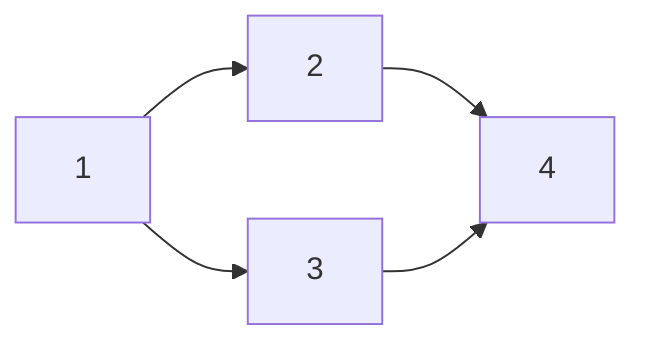
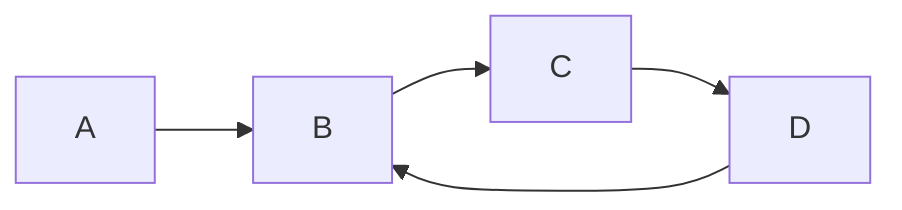
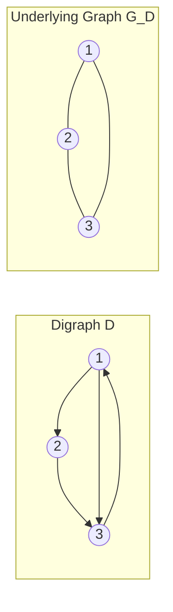
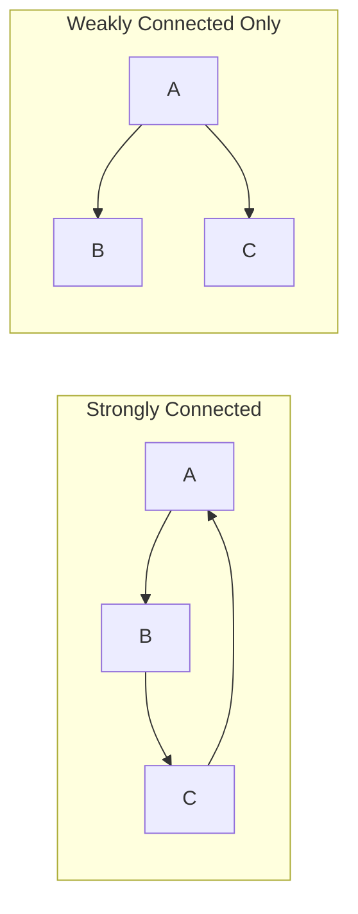
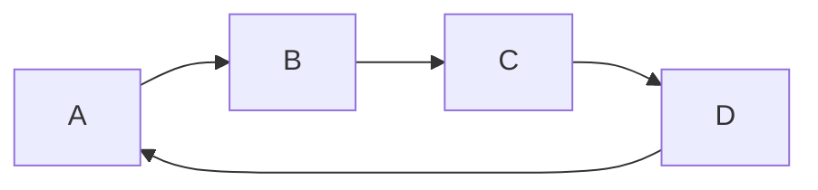

# SPL Run: build_concept_book

- **Adapter:** claude_cli
- **Model:** claude-sonnet-5
- **Tokens:** 7157 in / 3678 out
- **Latency:** 82912ms
- **Timestamp:** 2026-09-27 15:42:58

## Output

```output


---

## Directed Graph

A directed graph, or digraph, is a pair $D = (V, A)$, where $V$ is a finite set of vertices and $A$ is a set of arcs. Unlike an edge in an undirected graph, an arc $\langle u, v \rangle$ is an ordered pair: it points from a tail vertex $u$ to a head vertex $v$. This ordering matters — the arc $\langle u, v \rangle$ represents a relationship that flows in one direction, and it is distinct from the arc $\langle v, u \rangle$. A digraph can contain both, but they are two separate arcs, not one bidirectional connection.

The ordering is what makes digraphs the natural model for asymmetric relationships: a one-way street, a prerequisite requirement, a follower on a social network, a dependency between software modules, or a web page linking to another. In each case, the relationship "A points to B" does not imply "B points to A."

**Worked example.** Consider a small task-scheduling digraph with $V = \{1, 2, 3, 4\}$ and arcs $A = \{\langle 1,2\rangle, \langle 1,3\rangle, \langle 2,4\rangle, \langle 3,4\rangle\}$. Vertex 1 has out-degree 2 (arcs leaving it) and in-degree 0 (no arcs entering it), so task 1 must be completed before tasks 2 and 3 can begin. Vertex 4 has in-degree 2 and out-degree 0: it depends on both 2 and 3 finishing first. Notice that swapping any arc's direction, say replacing $\langle 1,2\rangle$ with $\langle 2,1\rangle$, changes the meaning of the schedule entirely — task 2 would now have to precede task 1. This sensitivity to direction is exactly why representing dependencies as an undirected graph would lose essential information.

**Problem-solving application.** When working with digraphs, the first computational step is almost always to determine each vertex's in-degree and out-degree, since these reveal structural roles: a vertex with in-degree 0 is a source (a valid starting point, like task 1 above), and a vertex with out-degree 0 is a sink (a valid endpoint, like task 4). Identifying sources and sinks is the basis for topological sorting, which orders the vertices of an acyclic digraph so that every arc points from an earlier vertex to a later one — a technique used directly in build systems, course-prerequisite planning, and spreadsheet cell evaluation order.


*A digraph modeling task dependencies: task 1 is a source, task 4 is a sink, and the arc directions dictate a valid execution order.*

---

## Directed Walks Paths Cycles

In a digraph, an arc points from one vertex to another, and this direction restricts how you may travel along a sequence of arcs. A directed walk is a sequence of vertices $v_0, v_1, \dots, v_k$ together with arcs $v_0 \to v_1, v_1 \to v_2, \dots, v_{k-1} \to v_k$, where each arc must be followed in its stated direction — you cannot traverse $v_1 \to v_0$ if only the arc $v_0 \to v_1$ exists. A directed trail forbids repeating an arc; a directed path forbids repeating a vertex entirely. A directed cycle is a directed path that returns to its starting vertex, using only arcs traversed forward, with no other vertex repeated along the way.

Consider a digraph modeling task dependencies: $A \to B$, $B \to C$, $C \to D$, and $D \to B$. The sequence $A, B, C, D$ is a directed path of length 3, since each arc is used once in its correct direction and no vertex repeats. The sequence $B, C, D, B$ is a directed cycle, because it returns to $B$ without revisiting $C$ or $D$. Notice that $D, C$ is not a valid directed walk at all, since the only arc between $C$ and $D$ points from $C$ to $D$, not the reverse — this is the key distinction from undirected graphs, where either endpoint could serve as the starting point of a step.

This distinction matters directly for problem-solving. When you ask whether a digraph contains a directed cycle, you are really asking whether a system of dependencies is consistent — a directed cycle in a task-dependency digraph means task $B$ depends (transitively) on task $D$, which depends on $B$, an impossible ordering to schedule. Detecting the presence or absence of directed cycles is exactly the test for whether a digraph admits a topological ordering: a digraph has a valid topological sort if and only if it is acyclic. In practice, you search for directed cycles using a depth-first traversal that tracks vertices currently on the active recursion stack; encountering an arc back to a vertex on that stack, rather than merely a previously visited vertex, signals a directed cycle. This is the mechanism build systems, spreadsheet formula engines, and course-prerequisite checkers use to detect and report circular dependencies before they cause deadlock or infinite recomputation.



*A digraph containing the directed path A→B→C→D and the directed cycle B→C→D→B.*

---

## Underlying Graph

**Definition.** Given a digraph $D = (V, A)$, the underlying graph is the undirected graph $G(D) = (V, E)$ obtained by replacing every arc with an undirected edge, then discarding duplicate edges. Formally, $\{u, v\} \in E$ if and only if $(u, v) \in A$ or $(v, u) \in A$. The transformation forgets direction entirely: a single arc $(u, v)$, a single arc $(v, u)$, and a pair of mutual arcs $(u,v)$ and $(v,u)$ all collapse to the same undirected edge $\{u, v\}$. Consequently $|E| \le |A|$, with equality only when $D$ has no pair of opposite arcs between the same two vertices.

**Worked example.** Let $D$ have vertex set $V = \{1, 2, 3\}$ and arc set $A = \{(1,2), (2,3), (3,1), (1,3)\}$. Note that $(3,1)$ and $(1,3)$ are opposite arcs joining the same pair. In $G(D)$, these both become the single edge $\{1,3\}$, so $E = \{\{1,2\}, \{2,3\}, \{1,3\}\}$ — a triangle with $3$ edges, even though $D$ had $4$ arcs.

**Problem-solving application.** The underlying graph is the standard tool for importing undirected-graph theorems into the study of digraphs. A digraph is called *weakly connected* precisely when its underlying graph is connected — that is, when you can travel between any two vertices while ignoring arc direction. This matters in practice: a citation network or dependency graph might be strongly connected only in rare cases, but checking weak connectivity (via the underlying graph) tells you whether the structure is "one piece" at all, which is the first sanity check before running any directed algorithm on it.

The same idea underlies degree bookkeeping. If $d^+(v)$ and $d^-(v)$ denote out-degree and in-degree in $D$, the degree of $v$ in $G(D)$ satisfies

$$
d_{G(D)}(v) \le d^+(v) + d^-(v),
$$

with equality unless $v$ has both an arc to and from the same neighbor. This inequality is a quick check when converting adjacency data: if your computed undirected degree ever exceeds $d^+(v) + d^-(v)$, you have a bug in the conversion.


*Left: a digraph with arcs $1\to2$, $2\to3$, $3\to1$, and $1\to3$. Right: its underlying graph, where the opposite arcs between 1 and 3 merge into one edge.*

---

## Strong Weak Connectivity

A directed graph, or digraph, consists of vertices connected by directed edges — edges that point from one vertex to another rather than simply linking them. Connectivity in a digraph is more subtle than in an undirected graph because the direction of edges can block travel even when a path exists in principle. A digraph is **strongly connected** if, for every pair of vertices $u$ and $v$, there exists a directed path from $u$ to $v$ and also a directed path from $v$ to $u$. A digraph is **weakly connected** if its underlying undirected graph — the graph obtained by ignoring edge direction — is connected, meaning some path (regardless of direction) connects every pair of vertices.

Consider a digraph with vertices $A$, $B$, $C$ where edges are $A \to B$, $B \to C$, and $C \to A$. This forms a directed cycle, so every vertex can reach every other vertex by following the arrows; the digraph is strongly connected. Now replace the last edge with $A \to C$ instead of $C \to A$. The underlying undirected graph is still connected, so the digraph is weakly connected, but it is no longer strongly connected: there is no directed path from $C$ back to $A$ or $B$.

This distinction matters directly in problem-solving. In a road network modeled as a digraph (one-way streets as directed edges), strong connectivity guarantees that any location is reachable from any other — a critical requirement for delivery routing or emergency response planning. Weak connectivity only guarantees the network is "connected" in the loose sense that no location is completely isolated from the rest, but some destinations may be unreachable from certain starting points. Algorithmically, testing strong connectivity is done efficiently using Tarjan's or Kosaraju's algorithm, both of which run in $O(V + E)$ time by performing depth-first search and partitioning the digraph into maximal strongly connected components. Testing weak connectivity is simpler: convert edges to undirected and run a single depth-first or breadth-first search.


*Left: a directed cycle where every vertex reaches every other vertex, making the digraph strongly connected. Right: the same three vertices with one edge reversed direction — the underlying graph is still connected, but vertex C can no longer reach A or B.*

---

## Communication Network Routing

A communication or transportation network is naturally modeled as a directed graph (digraph) $G = (V, E)$, where nodes $V$ represent routers, cities, or relay stations, and directed edges $E$ represent one-way links — a fiber-optic connection, a one-way street, or an asymmetric radio channel. The central question for reliability is: can every node reach every other node? A digraph is **strongly connected** if, for every ordered pair of nodes $u, v \in V$, there exists a directed path from $u$ to $v$. This is a stronger requirement than ordinary (weak) connectivity, which only asks that the graph be connected if edge directions are ignored.

**Worked example.** Consider a four-node network with edges $A \to B$, $B \to C$, $C \to D$, and $D \to A$. This forms a directed cycle. Even though no single edge is bidirectional, every node can reach every other node by traveling around the cycle — for instance, $B$ reaches $D$ via $B \to C \to D$. This digraph is strongly connected. Now suppose we delete the edge $D \to A$. The graph is still weakly connected (ignoring direction, it's a path), but $D$ can no longer reach $A$, $B$, or $C$: strong connectivity fails. This distinction matters operationally — a network administrator glancing at an undirected sketch of the topology could wrongly conclude the system is robust, missing that traffic can flow in only one direction around the loop.

**Problem-solving application.** Testing strong connectivity by checking all $|V|(|V|-1)$ pairs is impractical for large networks. Instead, algorithms like Kosaraju's or Tarjan's compute the graph's **strongly connected components (SCCs)** — maximal subsets where every node reaches every other — in $O(|V| + |E|)$ time, using two depth-first searches. A network is strongly connected exactly when it consists of a single SCC. In practice, network engineers use this test to find single points of failure: an edge whose removal splits one SCC into several is a critical link, and the design task becomes adding a redundant reverse-direction path to restore full connectivity, guaranteeing that a message can always be rerouted even if one direction of a link fails.


*A directed cycle: removing any single edge, such as D → A, breaks strong connectivity even though the underlying undirected graph stays connected.*

---

## Payoff

Every communication network, transportation system, and power grid is, at its core, a digraph: nodes are routers, airports, or substations, and directed edges are the links along which a message, a flight, or current can actually travel. The question an engineer asks first is not "how fast" or "how cheap," but "can everything reach everything else?" That question is exactly what strong connectivity answers. A digraph is strongly connected when for every ordered pair of nodes $u$ and $v$, there exists a directed path from $u$ to $v$ and a directed path from $v$ to $u$. When a network has this property, no node is stranded: any message can be routed to any destination, regardless of which node originates it. This is why strong connectivity is the natural endpoint of the chapter — it converts an abstract graph property into a concrete engineering guarantee about a real system's usability.

Weak connectivity, the concept this one builds on, is what makes the distinction meaningful. A digraph is weakly connected if replacing every directed edge with an undirected one yields a single connected component — the network is "in one piece" but not necessarily navigable in every direction. Consider a network of routers where link $A \to B$ exists but no link routes back from $B$ to $A$; the underlying structure is weakly connected, yet a packet originating at $B$ can never reach $A$. Real infrastructure fails this way constantly: a one-way fiber link, a misconfigured firewall rule, a broadcast tower with no return channel. Testing only for weak connectivity would certify such a network as "connected" while missing the routing failure. Strong connectivity is the sharper, operationally correct test, and it directly formalizes the design goal stated in the concept: any node can route to any other node.

In practice, engineers apply this by computing the strongly connected components of a network graph — using algorithms like Tarjan's or Kosaraju's — to identify which clusters of nodes are mutually reachable and which links, if severed, would break routing entirely. A single added or reversed edge can merge two components into one fully strongly connected network, turning a fragile, one-directional topology into a resilient one.

Take a directed graph representing your city's public transit lines, your home Wi-Fi mesh, or a supply chain, and check: is it strongly connected? If not, find the missing edge that would make it so — that edge is often the cheapest fix with the largest payoff.
```
