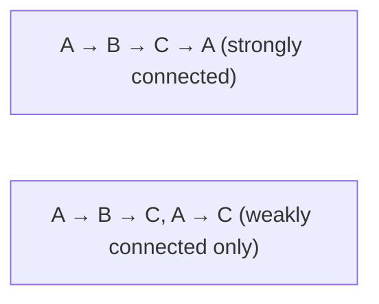
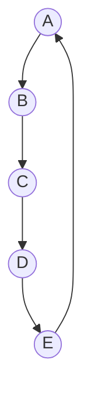

# SPL Run: build_concept_book

- **Adapter:** claude_cli
- **Model:** claude-sonnet-5
- **Tokens:** 12196 in / 5790 out
- **Latency:** 182772ms
- **Timestamp:** 2026-09-27 15:44:22

## Output

```output


---

## Directed Graph

A directed graph, or digraph, extends the idea of a graph by giving each connection a direction. Formally, a digraph is defined as $D = (V, A)$, where $V$ is a finite set of vertices and $A$ is a set of arcs (also called directed edges). Each arc is written as an ordered pair $\langle u, v \rangle$, where $u$ is the tail and $v$ is the head. The order matters: $\langle u, v \rangle$ represents a connection running from $u$ to $v$, and it is not the same as $\langle v, u \rangle$ unless both arcs are explicitly present. This distinguishes a digraph from an undirected graph, where an edge $\{u, v\}$ has no orientation.

Two structural quantities matter for each vertex: the out-degree, the number of arcs leaving it, and the in-degree, the number of arcs entering it. A vertex with out-degree zero and positive in-degree acts as a sink; one with in-degree zero and positive out-degree acts as a source. Summing out-degrees over all vertices equals the total number of arcs $|A|$, and the same is true for in-degrees — every arc contributes exactly one unit of out-degree to its tail and one unit of in-degree to its head.

Consider a small road network modeled as a digraph: $V = \{A, B, C\}$, with one-way streets given by arcs $\langle A, B \rangle$, $\langle B, C \rangle$, and $\langle C, A \rangle$. A driver at intersection $A$ can reach $B$ directly, but cannot travel from $B$ back to $A$ without first passing through $C$. This directional constraint is exactly what the digraph captures that an undirected graph would lose: an undirected edge $\{A, B\}$ would wrongly imply two-way travel.

Digraphs are the natural model whenever a relationship is asymmetric — task dependencies in a project schedule, follower relationships on a social network, or hyperlinks between web pages. A common problem-solving task is determining reachability: given a starting vertex $s$, which vertices can be reached by following arcs in their given direction? Solving this requires tracing paths that respect arc orientation, which is the foundation for algorithms such as depth-first search applied to directed structures, and for detecting cycles that indicate circular dependencies in a system.

---

## In Out Neighbor Sets

In a directed graph, every arc has a direction, so each vertex plays two distinct roles: it can be the source of an arc or the destination of an arc. This asymmetry is captured by two companion sets. For a vertex $v$ in a digraph $G = (V, E)$, the in-neighbor set is defined as

$$
N^-(v) = \{ u \in V : (u, v) \in E \}
$$

the collection of all vertices with an arc pointing directly into $v$. The out-neighbor set is defined symmetrically as

$$
N^+(v) = \{ w \in V : (v, w) \in E \}
$$

the vertices that $v$ points to. These two sets need not be related in size or membership — a vertex can have many in-neighbors and no out-neighbors (a "sink"), or the reverse (a "source"). The sizes of these sets are exactly the in-degree, $|N^-(v)|$, and out-degree, $|N^+(v)|$, of $v$.

**Worked example.** Consider a digraph modeling a small social media network where an arc from $u$ to $v$ means "$u$ follows $v$." Suppose the arcs are: Ann → Bo, Cy → Bo, Bo → Dee, Dee → Ann. Then $N^-(\text{Bo}) = \{\text{Ann}, \text{Cy}\}$ (Bo's followers) and $N^+(\text{Bo}) = \{\text{Dee}\}$ (who Bo follows). Note Ann is in Bo's in-neighbor set but not vice versa — the relationship is one-directional, which is exactly what the two separate sets are built to express.

**Problem-solving application.** These sets are the computational backbone of graph traversal and dependency analysis. In a task-scheduling system represented as a digraph (arc $u \to v$ means "task $u$ must finish before task $v$ starts"), a task $v$ is ready to run only when every member of $N^-(v)$ has completed — this is precisely the check used in topological sorting algorithms like Kahn's algorithm, which repeatedly removes vertices whose in-neighbor set has shrunk to empty. Conversely, $N^+(v)$ tells you which tasks become unblocked once $v$ finishes, which is what you traverse when propagating a state change (as in a breadth-first search or a spreadsheet's dependency recalculation). In practice, an adjacency-list representation typically stores $N^+(v)$ directly per vertex, while $N^-(v)$ is either maintained as a separate reverse adjacency list or computed on demand by scanning all arcs — a design choice with real performance consequences when a program needs to repeatedly ask "who depends on this?"

---

## Directed Walks Paths Cycles

In a digraph $D = (V, A)$, a directed walk is a sequence of vertices and arcs $v_0, a_1, v_1, a_2, v_2, \ldots, a_k, v_k$ where each arc $a_i$ goes from $v_{i-1}$ to $v_i$ — the direction of every arc must agree with the direction of travel. This is the key departure from undirected graphs: you cannot traverse an arc backward. A directed trail is a directed walk with no repeated arcs; a directed path is a directed walk with no repeated vertices (which automatically forbids repeated arcs). A directed cycle is a directed path $v_0, v_1, \ldots, v_k$ together with the arc $v_k \to v_0$, so the walk closes on itself with $k \geq 1$ distinct vertices and no repeated arcs except the closing one.

Consider $D$ with vertices $\{1,2,3,4\}$ and arcs $1\to2$, $2\to3$, $3\to4$, $4\to1$, $3\to1$. The sequence $1,2,3,4,1$ is a directed cycle of length 4. The sequence $1,2,3,1$ is a shorter directed cycle of length 3, using arcs $1\to2$, $2\to3$, $3\to1$. Note that $4,1,2,3,4$ is *not* a valid directed walk unless the arc $3\to4$ exists in that orientation — reversing $4\to1$ to read $1\to4$ would be illegal, since no arc $1\to4$ was defined.

This distinction matters for problem-solving: many algorithms depend on whether a digraph contains any directed cycle at all. A digraph is called a directed acyclic graph, or DAG, precisely when it contains no directed cycle. Detecting this is a standard task — depth-first search flags a directed cycle whenever it encounters a "back edge," an arc pointing into a vertex still on the current recursion stack. This single check underlies topological sorting: a linear ordering of vertices consistent with all arc directions exists if and only if the digraph is acyclic. Task scheduling, build systems, and course-prerequisite validation all reduce to exactly this test — build the digraph of dependencies, then search for a directed cycle before attempting to order the vertices.

---

## Indegree Outdegree

In a directed graph, each arc has a direction: it leaves one vertex and enters another. This asymmetry means every vertex has two separate degree counts instead of one. The indegree of a vertex $v$, written $\deg^-(v)$, is the number of arcs that have $v$ as their head (arcs pointing into $v$). The outdegree, written $\deg^+(v)$, is the number of arcs that have $v$ as their tail (arcs pointing out of $v$). The total degree of $v$ is simply the sum $\deg(v) = \deg^-(v) + \deg^+(v)$.

A key structural fact follows directly from the definitions: since every arc contributes exactly one head and one tail, summing indegree over all vertices must equal summing outdegree over all vertices, and both equal the total number of arcs $m$:

$$\sum_{v \in V} \deg^-(v) = \sum_{v \in V} \deg^+(v) = m$$

**Worked example.** Consider a directed graph with arcs $(A,B)$, $(A,C)$, $(B,C)$, $(C,A)$. Vertex $A$ has one arc leaving to $B$ and one to $C$, so $\deg^+(A) = 2$; it has one arc entering from $C$, so $\deg^-(A) = 1$. Vertex $C$ has arcs entering from $A$ and $B$, giving $\deg^-(C) = 2$, and one arc leaving to $A$, giving $\deg^+(C) = 1$. Checking the totals: outdegrees sum to $2+1+1=4$, indegrees sum to $1+1+2=4$, matching the arc count $m=4$.

**Problem-solving application.** Indegree and outdegree let you diagnose structural roles in a network without inspecting the whole graph. A vertex with indegree zero is a source — nothing feeds into it, as with a task in a project schedule that has no prerequisites. A vertex with outdegree zero is a sink — a final deliverable, or a dead end in a web-crawl graph. In a web graph, a page's indegree measures how many other pages link to it, which is the raw signal behind PageRank-style ranking; its outdegree measures how many pages it links out to. When verifying whether a directed graph could represent a valid Eulerian circuit (a route traversing every arc exactly once and returning to the start), the required condition is that every vertex satisfies $\deg^-(v) = \deg^+(v)$. Computing these two counts for each vertex is also the first step in detecting sources, sinks, and bottlenecks before running algorithms like topological sort or network flow.

---

## Underlying Graph

Every digraph carries within it a shadow of undirected structure. Given a digraph $D = (V, A)$, the underlying graph of $D$, denoted $G(D)$, is the undirected graph $G(D) = (V, E)$ obtained by replacing each arc $(u, v) \in A$ with an undirected edge $\{u, v\}$. If both $(u, v)$ and $(v, u)$ appear as arcs in $D$ — a common situation when a relationship is mutual — they collapse into the single edge $\{u, v\}$ in $G(D)$, since an undirected graph does not distinguish direction or count parallel connections between the same pair of vertices. The underlying graph strips away directionality while preserving exactly which pairs of vertices are connected in some direction.

**Worked example.** Consider a digraph $D$ on vertices $\{A, B, C, D\}$ with arcs $A \to B$, $B \to C$, $C \to A$, and $B \to D$. To construct $G(D)$, replace each arc with an undirected edge: $\{A,B\}$, $\{B,C\}$, $\{A,C\}$, and $\{B,D\}$. The result is an undirected graph with a triangle on $\{A, B, C\}$ and a pendant edge to $D$. Notice that $D$ has 4 arcs and $G(D)$ has 4 edges here, but this need not hold in general — if $D$ also contained the arc $B \to A$, then $G(D)$ would still have only the single edge $\{A, B\}$, since $\{A,B\}$ was already present.

**Problem-solving application.** The underlying graph is the standard tool for importing undirected-graph theorems into directed settings. A key application: a digraph $D$ is called weakly connected if $G(D)$ is connected, meaning there is an undirected path between every pair of vertices once direction is ignored — a strictly weaker requirement than strong connectivity, where directed paths must exist in both directions. To test weak connectivity computationally, one simply builds $G(D)$ (by symmetrizing the adjacency matrix, effectively computing $A + A^{T}$ and treating any nonzero entry as an edge) and runs a standard connectivity check, such as breadth-first search, on the result. This reduction is why the underlying graph matters practically: rather than developing separate connectivity algorithms for directed structures, one converts the problem to the undirected case, solves it with familiar tools, and reads the answer back in terms of the original digraph.

---

## Degree Distribution

For a graph with $n$ vertices, the degree distribution is the function $P(k)$ giving the fraction of vertices whose degree equals $k$:

$$
P(k) = \frac{|\{v \in V : \deg(v) = k\}|}{n}
$$

For a directed graph, in-degree and out-degree are tracked separately, giving two distributions, $P_{\text{in}}(k)$ and $P_{\text{out}}(k)$. Plotting $P(k)$ against $k$ reveals the overall connectivity pattern of the network: whether most vertices have similar degree, or whether degree varies widely across the population.

**Worked example.** Consider a graph with six vertices and degree sequence $\{1, 1, 2, 2, 3, 5\}$. Here $n = 6$, so the degree distribution is $P(1) = \frac{2}{6}$, $P(2) = \frac{2}{6}$, $P(3) = \frac{1}{6}$, and $P(5) = \frac{1}{6}$. This tells us a third of the vertices are leaves (degree 1), and one vertex — the degree-5 vertex — connects to every other vertex in the graph, making it a likely hub.

**Problem-solving application.** Degree distribution is the standard first diagnostic for network structure, because its shape distinguishes fundamentally different generative processes. A random graph (Erdős–Rényi model), where each edge is included independently with fixed probability, produces a binomial degree distribution that concentrates tightly around the mean degree — most vertices look alike. Many real-world networks, including the web graph, citation networks, and social networks, instead follow a power-law distribution, $P(k) \sim k^{-\gamma}$ for some constant $\gamma$, typically between 2 and 3. In a power-law network, most vertices have low degree, but a small number of hub vertices have very high degree, and this heavy tail has no natural scale — hence the name "scale-free network." Recognizing this pattern matters practically: it explains why such networks are robust to random vertex failure (removing a random vertex is unlikely to hit a hub) but fragile to targeted attack (removing the top hubs quickly fragments the network). To apply this, plot degree against frequency on log-log axes; a roughly straight line is evidence of a power law, and its slope estimates $\gamma$, which analysts use to compare the resilience and hub-dependence of different real-world networks.

---

## Orientation

An orientation of an undirected graph $G$ is an assignment of a direction to every edge of $G$, turning each edge $\{u,v\}$ into exactly one directed arc, either $(u,v)$ or $(v,u)$. The result is a directed graph $D(G)$, called an orientation of $G$, that has the same vertex set and the same underlying edges as $G$, but with each edge now traversable in only one direction. A single graph with $m$ edges has $2^m$ possible orientations, since each edge independently gets one of two directions.

Orientation matters because many real systems are naturally undirected in structure but directional in function. Consider a graph representing a road network where every edge is a two-way street. If the city converts some streets to one-way to relieve congestion, it is choosing an orientation of the underlying graph. The choice is not arbitrary: a good orientation must still let every location reach every other location, and this is a property of $D(G)$, not of $G$ itself. In graph-theoretic terms, an orientation is called strongly connected if for every pair of vertices $u$ and $v$ there is a directed path from $u$ to $v$ and a directed path from $v$ to $u$. Robbins' theorem states that a connected graph $G$ has a strongly connected orientation if and only if $G$ is 2-edge-connected, meaning $G$ has no bridge (an edge whose removal disconnects the graph). This is a genuine structural theorem, not a restatement of intuition: it tells us exactly which graphs can be one-way-street systems without stranding any location.

Worked example: take a graph on four vertices $A, B, C, D$ forming a cycle $A\!-\!B\!-\!C\!-\!D\!-\!A$, plus a chord $A\!-\!C$. This graph is 2-edge-connected, since every edge lies on a cycle, so Robbins' theorem guarantees a strongly connected orientation exists. One such orientation directs the cycle consistently, $A\to B\to C\to D\to A$, and directs the chord as $C\to A$. Checking reachability confirms every vertex can reach every other vertex in both directions around the cycle.

Problem-solving application: to test whether a graph admits a strongly connected orientation, check for bridges first (via depth-first search low-link values); if none exist, orient each biconnected component consistently around a depth-first search tree, using tree edges forward and back edges backward — this constructive method, underlying Robbins' proof, directly produces a valid orientation rather than merely confirming one exists.

---

## Strong Weak Connectivity

A digraph consists of vertices joined by directed edges, and its connectivity properties depend on whether we respect edge direction. A digraph is **strongly connected** if, for every ordered pair of vertices $u$ and $v$, there exists a directed path from $u$ to $v$ and a directed path from $v$ to $u$. A digraph is **weakly connected** if its underlying undirected graph — the graph obtained by replacing every directed edge with an undirected edge — is connected. Strong connectivity implies weak connectivity, but the converse fails: a graph can look fully connected while ignoring direction, yet have no directed route back from certain vertices.

**Worked example.** Consider three vertices $A$, $B$, $C$ with directed edges $A \to B$, $B \to C$, and $C \to A$. This forms a directed cycle, so any vertex can reach any other by following the cycle: it is strongly connected. Now replace the edge $C \to A$ with $A \to C$ instead. The underlying undirected graph is still connected — every vertex is still linked to the others when direction is erased — so the digraph is weakly connected. But there is no directed path from $B$ back to $A$: you can leave $A$ but never return. This digraph is weakly, not strongly, connected.

**Problem-solving application.** Strong connectivity can be tested efficiently without checking all $n(n-1)$ vertex pairs individually. Kosaraju's algorithm and Tarjan's algorithm both decompose a digraph into maximal strongly connected components in $O(V + E)$ time, where $V$ is the number of vertices and $E$ the number of edges, by running depth-first search and tracking finishing order or low-link values. This matters in practice: in a web-link graph, strongly connected components reveal clusters of pages that can all reach one another; in a dependency graph, the absence of a large strongly connected component confirms there are no circular dependencies. When you encounter a digraph modeling a real process — task scheduling, communication networks, citation graphs — first ask whether direction matters for the question being posed. If the question is about routing information back and forth, test strong connectivity; if it only concerns whether the elements form one connected structure, weak connectivity suffices and is cheaper to check via ordinary graph traversal.


*Left cycle allows travel in both directions between every pair; right graph is connected when direction is ignored, but B cannot reach A.*

---

## Strongly Connected Orientation

An orientation of an undirected graph assigns a direction to every edge, turning each undirected edge into a directed one. An orientation is called strongly connected if, in the resulting directed graph, there is a directed path from every vertex to every other vertex. Not every graph admits such an orientation — a bridge (an edge whose removal disconnects the graph) can never be oriented consistently with strong connectivity, since traffic could only flow one way across it, stranding whichever side lies "downstream." This observation is the seed of a complete characterization: a connected graph $G$ has a strongly connected orientation if and only if $G$ is 2-edge-connected, meaning its edge connectivity satisfies $\lambda(G) \geq 2$ (no single edge removal disconnects it). This result is known as Robbins' theorem, proved by Herbert Robbins in 1939 in the context of converting two-way streets to one-way streets while preserving reachability.

Consider a cycle graph on five vertices, $C_5$. It is 2-edge-connected, since removing any one edge leaves the rest still connected as a path. Orienting every edge consistently around the cycle (say, clockwise) produces a single directed cycle, and in a directed cycle every vertex reaches every other vertex by traveling around it. Now compare this to a "barbell" graph: two triangles joined by a single connecting edge. That connecting edge is a bridge — removing it disconnects the graph, so $\lambda(G) = 1$. No matter how the connecting edge is directed, vertices on the far side of that edge can never send traffic back across it, so no strongly connected orientation exists.

Robbins' theorem also yields an algorithmic recipe: to construct a strongly connected orientation, perform a depth-first search from any vertex, orient every tree edge from parent to child, and orient every back edge from descendant to ancestor. In a 2-edge-connected graph, this DFS-based orientation is guaranteed to be strongly connected, because 2-edge-connectivity ensures every non-tree edge closes a cycle back toward the root, giving every branch a return path. This gives a constructive, linear-time method (running in $O(V + E)$ time) for solving problems such as converting a road network into one-way streets while keeping every location mutually reachable, or ensuring a communication network remains fully connected under directional (simplex) links.


*A strongly connected orientation of the cycle graph $C_5$: directing all edges consistently around the cycle guarantees a directed path between every pair of vertices.*

---

## Payoff

Robbins' theorem is the answer to a question that has been building since we first counted how many edges touch a vertex: can a road network, a communication network, or a circuit be directed so that you can always get from anywhere to anywhere else? The theorem states it precisely — a connected undirected graph $G$ admits a strongly connected orientation if and only if $G$ is 2-edge-connected, meaning $\lambda(G) \geq 2$, the minimum number of edges whose removal disconnects the graph is at least two. This is the natural endpoint of the story, because it converts a global, seemingly hard-to-check property (does *some* assignment of directions make the whole graph strongly connected?) into a purely local, structural test on the undirected graph itself.

Every idea from this book converges here. Degree distribution first taught us to read a graph through the arithmetic of edges at each vertex, and orientation showed that any orientation splits each vertex's degree into in-degree and out-degree — but a badly chosen split can strand a vertex, unable to reach or be reached. Strong and weak connectivity then gave us the vocabulary to distinguish "you can get there" from "there merely exists a directed path some way through," which is exactly the property Robbins' theorem guarantees can be achieved, but only when a bridge — a single edge whose removal disconnects $G$ — is nowhere in sight. A bridge has no second route to absorb a bad directional choice; whichever way you orient it, one side becomes unreachable from the other. So 2-edge-connectivity is not an arbitrary condition — it is precisely the absence of that failure mode.

Try it yourself: take a cycle graph, confirm $\lambda(G) = 2$, and orient every edge consistently clockwise — strongly connected, as promised. Now add a pendant edge sticking out from one cycle vertex; that edge is a bridge, and no matter how you direct it, the endpoint becomes a dead end or an unreachable source. Robbins' constructive proof, built from an ear decomposition of the graph, gives you an algorithm, not just an existence guarantee — a natural next step for turning this theorem into working code.
```
