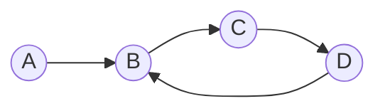
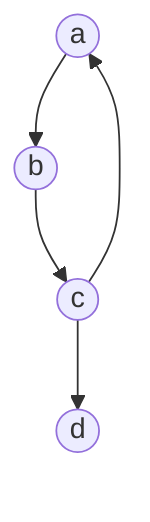
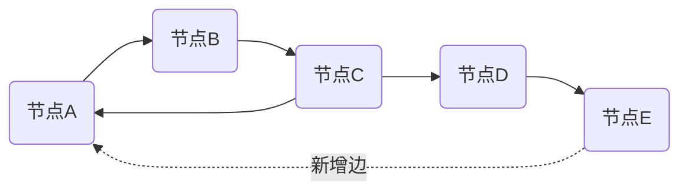

# SPL Run: build_concept_book

- **Adapter:** claude_cli
- **Model:** claude-sonnet-5
- **Tokens:** 7191 in / 1532 out
- **Latency:** 145847ms
- **Timestamp:** 2026-09-27 20:01:35

## Output

```output


---

## 有向图

**定义**　有向图（记作 $D = (V, A)$）由顶点集 $V$ 与弧集 $A$ 组成，其中每条弧 $\langle u, v \rangle \in A$ 从**尾顶点** $u$ 指向**头顶点** $v$。与无向图的边不同，弧是有方向的有序对，因此 $\langle u, v \rangle$ 与 $\langle v, u \rangle$ 是两条不同的弧，可以同时存在，也可以只存在其中一条。对于顶点 $v$，定义其**出度** $d^+(v)$ 为以 $v$ 为尾的弧的数目，**入度** $d^-(v)$ 为以 $v$ 为头的弧的数目。一个基本而重要的关系是：

$$\sum_{v \in V} d^+(v) = \sum_{v \in V} d^-(v) = |A|$$

这是因为每条弧恰好为某个顶点贡献一次出度、为另一个顶点贡献一次入度，弧的总数自然等于出度总和，也等于入度总和。

**实例分析**　考虑顶点集 $V = \{A, B, C\}$，弧集 $A = \{\langle A,B \rangle, \langle B,C \rangle, \langle C,A \rangle, \langle A,C \rangle\}$。此时 $d^+(A) = 2$（指向 $B$ 和 $C$），$d^-(A) = 1$（仅来自 $C$）；顶点 $B$、$C$ 的出度、入度各为 $1$、$1$ 和 $1$、$2$。验证总和：$d^+$ 之和为 $2+1+1=4$，$d^-$ 之和为 $1+1+2=4$，恰好等于弧数 $|A|=4$，与上式一致。有向图常用**邻接矩阵** $M$ 表示，其中 $M_{ij}=1$ 当且仅当 $\langle i,j\rangle \in A$；这一矩阵形式是后续路径计数、可达性分析的基础。

**问题求解应用**　判断有向图中两点间是否存在长度为 $k$ 的路径，可通过计算邻接矩阵的 $k$ 次幂 $M^k$ 实现：矩阵元素 $(M^k)_{ij}$ 给出从顶点 $i$ 到顶点 $j$、长度恰为 $k$ 的路径数目。这一技巧广泛用于网络可达性分析、任务依赖调度（判断是否存在环）以及网页排名等实际问题——只需将系统建模为有向图，出度、入度与路径计数即可转化为具体的矩阵运算任务。

---

## Directed Walks Paths Cycles

**定义**：在有向图 $D = (V, A)$ 中，一条**有向途径**（directed walk）是顶点与弧交替出现的序列
$$
v_0, a_1, v_1, a_2, v_2, \ldots, a_k, v_k
$$
其中每条弧 $a_i$ 都必须以 $v_{i-1}$ 为起点、$v_i$ 为终点，即 $a_i = (v_{i-1}, v_i)$。这与无向图不同：弧的方向是硬约束，不能反向使用。途径的长度为弧数 $k$。

若途径中所有**弧**互不相同，称为**有向迹**（directed trail）；若所有**顶点**互不相同（起点终点除外），称为**有向路径**（directed path）；若 $v_0 = v_k$ 且中间顶点互不相同、弧数 $k \geq 1$，则称为**有向圈**（directed cycle）。一个不含任何有向圈的有向图称为**有向无环图**（DAG），这是拓扑排序、任务调度、依赖分析等应用的基础结构。

**举例**：设有向图含顶点 $\{A, B, C, D\}$ 和弧集 $\{(A,B), (B,C), (C,D), (D,B)\}$。序列 $A, B, C, D$ 是一条有向路径（长度 3）。而 $B, C, D, B$ 是一条有向圈，因为它从 $B$ 出发又回到 $B$，且中间顶点 $C, D$ 不重复。注意 $D, C$ 不是合法的弧——因为图中只有 $(C,D)$，没有反向的 $(D,C)$，所以 $C \to D \to C$ 这样的走法不存在。

**问题求解应用**：判断某序列是否为合法有向路径，需要逐条检查方向是否与弧集匹配，这正是深度优先搜索（DFS）中回溯判断"能否前进"的核心逻辑。更进一步，判断一个有向图是否含有有向圈（即是否为 DAG），是拓扑排序算法的先决步骤：若 DFS 过程中访问到当前递归栈内的顶点，就说明存在有向圈，拓扑排序失败。这一判断在编译器的依赖解析、任务流水线调度中至关重要。



*图示：$A \to B \to C \to D$ 构成一条有向路径，而 $B \to C \to D \to B$ 构成一条有向圈。*

---

## Underlying Graph（底图）

**定义**　给定一个有向图 $D = (V, A)$，其中 $A$ 是弧（有方向的边）的集合，将 $D$ 中每一条弧的方向去掉，只保留其连接的两个顶点，就得到一个无向图，称为 $D$ 的**底图**（underlying graph），记作 $G(D)$。形式上，若 $D$ 中存在弧 $(u, v)$，则 $G(D)$ 中存在边 $\{u, v\}$；顶点集合保持不变，即 $V(G(D)) = V(D)$。需要注意的是，如果 $D$ 中同时存在弧 $(u,v)$ 和 $(v,u)$（即一对反向弧，构成一个"2-圈"），在底图中它们通常被合并为**同一条**无向边，除非上下文明确要求保留多重边。

**辨析要点**：底图丢弃的唯一信息是"方向"，顶点数、边（弧）的连接关系本身完全保留。这意味着底图上的许多结构性质——连通性、是否含圈、顶点度数之和——都可以直接从原有向图的连接模式判断，但诸如"可达性""强连通分量""是否存在有向圈"这些依赖方向的性质，在转为底图后就会丢失或改变含义。

**举例**　设有向图 $D$ 的顶点集为 $\{A, B, C\}$，弧集为 $\{(A,B), (B,C), (C,A)\}$，这是一个有向三角形（有向圈）。它的底图 $G(D)$ 顶点仍是 $\{A, B, C\}$，边集为 $\{\{A,B\}, \{B,C\}, \{C,A\}\}$——恰好是一个无向三角形，即 3 阶完全图 $K_3$。反过来考虑另一有向图 $D'$，弧集为 $\{(A,B), (B,A), (B,C)\}$：其中 $(A,B)$ 与 $(B,A)$ 是一对反向弧。取底图时，这两条弧合并为一条边 $\{A,B\}$，因此 $G(D')$ 的边集为 $\{\{A,B\}, \{B,C\}\}$，是一条长度为 2 的路径，而不是含有"重边"的图。

**问题求解应用**　底图这一概念在算法设计中非常实用：许多图论问题（例如判断图是否连通、是否存在环、计算最短路径的下界）在无向情形下有更成熟或更简单的算法。工程实践中常见做法是：先对有向图 $D$ 取底图 $G(D)$，用无向图算法（如并查集判断连通分量、DFS 检测圈）快速筛出候选结构，再回到原有向图上验证方向敏感的性质（如是否强连通）。例如，判断一个有向图是否为"弱连通"，其标准定义就是：$D$ 是弱连通的，当且仅当其底图 $G(D)$ 是连通的。这正是底图概念在算法判定中最直接的应用场景。

---

## Strong Weak Connectivity

**定义**

设有向图 $G=(V,E)$。若对任意一对顶点 $u,v\in V$，既存在从 $u$ 到 $v$ 的有向路径，也存在从 $v$ 到 $u$ 的有向路径，则称 $G$ 是**强连通**的。强连通要求"双向可达"，方向性被完全保留。

若忽略边的方向，把每条有向边看作无向边后得到的**基础图**（underlying graph）是连通的，则称 $G$ 是**弱连通**的。弱连通只关心图在结构上是否"连在一起"，不管能否按箭头方向来回走。

显然，强连通蕴含弱连通，但反过来不成立：一个单向链式的有向图（如 $a\to b\to c$）是弱连通的，却不是强连通的，因为无法从 $c$ 回到 $a$。

**举例**

考虑顶点集 $\{a,b,c,d\}$，边为 $a\to b,\ b\to c,\ c\to a,\ c\to d$。其中 $a,b,c$ 三者互相可达，构成一个强连通分量；但 $d$ 只能被到达，无法回到其他顶点，因此整图不是强连通的。若去掉方向，$d$ 仍通过 $c$-$d$ 这条边与其余顶点相连，所以整图是弱连通的。像 $\{a,b,c\}$ 这样极大的强连通子集，称为该图的一个**强连通分量**（strongly connected component, SCC）。

**算法应用**

判断强连通性有一个简洁的判据：从任意顶点 $v$ 出发做深度优先搜索，若能到达所有顶点，再对反转所有边得到的图 $G^{T}$ 从 $v$ 出发做一次深度优先搜索，若同样能到达所有顶点，则 $G$ 强连通。这正是 Kosaraju 算法求强连通分量的核心思想，配合 Tarjan 算法，均可在 $O(|V|+|E|)$ 时间内求出全部强连通分量。把每个强连通分量收缩成一个点后得到的图称为**凝聚图**（condensation），它必然是一个有向无环图（DAG），这一性质在编译器的依赖分析、社交网络的影响力传播建模中被广泛使用。


*示例有向图：$a,b,c$ 构成强连通分量（可相互往返），$d$ 仅可被到达；整体属于弱连通图。*

---

## Communication Network Routing

将通信网络或交通网络建模为有向图 $G=(V, E)$，顶点集合 $V$ 表示节点（路由器、城市、服务器），边集合 $E$ 表示带方向的连接。若 $(u,v)\in E$，表示信息可以从 $u$ 单向传递到 $v$，但不必然能从 $v$ 返回 $u$。当图中任意两个顶点 $u,v$ 之间，同时存在从 $u$ 到 $v$ 与从 $v$ 到 $u$ 的有向路径时，称该图是**强连通的**（strongly connected）。强连通性正是路由可靠性的数学保证：只要网络强连通，任何节点发出的信息最终都能到达网络中的任何其他节点，无论中间转发多少次。

现实网络往往并非全局强连通。此时可将顶点划分为若干极大的**强连通分量**（strongly connected component，SCC）——同一分量内任意两点互相可达，不同分量之间至多单向可达。将每个分量收缩为一个点，得到的**压缩图**（condensation）一定是有向无环图（DAG）。用 Kosaraju 或 Tarjan 算法，可在线性时间 $O(|V|+|E|)$ 内求出所有 SCC，这比逐对检验可达性的 $O(|V|^2)$ 开销小得多，对大规模网络分析至关重要。

**举例**：五个路由器 $A,B,C,D,E$，边为 $A\to B,\ B\to C,\ C\to A,\ C\to D,\ D\to E$。$\{A,B,C\}$ 互相可达，构成一个 SCC；$D$、$E$ 各自是单点分量。压缩图是一条链 $\{A,B,C\}\to D\to E$：消息能从 $A$ 一路送到 $E$，但 $E$ 无法回传到 $A,B,C$，说明该网络尚未强连通。

**工程应用**：若要用最少的新链路使整张网络强连通，已知结果是

$$
\text{最少新增边数} = \max(\,\text{压缩图中入度为0的分量数},\ \text{压缩图中出度为0的分量数}\,)
$$

（当分量数大于 1 时）。上例中压缩图只有一个入度为零的源分量 $\{A,B,C\}$ 和一个出度为零的汇分量 $E$，故只需增加 1 条边，例如 $E\to A$，即可使全网强连通，实现任意节点间的双向路由。


*示例网络的有向图：实线为原有连接，虚线为使全图强连通所需新增的最少边。*

---

## Payoff

通信网络路由的核心问题是:给定一个由通信节点(路由器、基站、交换机)和连接它们的链路构成的网络,如何保证任意一个节点都能把数据可靠地送达任意另一个节点,即使网络中的某些链路是单向的(比如非对称带宽、单向卫星链路,或者层级式的转发策略)?这正是有向图理论要回答的问题,而强连通性正是这个保证的数学表达:一个有向图是强连通的,当且仅当对于任意两个节点 $u$ 和 $v$,都存在一条从 $u$ 到 $v$ 的有向路径,也存在一条从 $v$ 到 $u$ 的有向路径。这个概念是整本教材的自然终点,因为它把"图能否被遍历"这一抽象问题,直接转化为"网络是否可用"这一工程问题。

强连通与弱连通这两个概念在这里正式发挥作用。弱连通只保证把有向边看成无向边之后图是连通的——也就是说,数据理论上"存在某种路径"能够到达,但方向可能不对,导致实际路由失败。举例来说,一个由 A→B、B→C、A→C 构成的网络是弱连通的(去掉方向后三点相连),但并非强连通,因为没有任何路径能从 C 返回到 A。在真实网络中,这意味着 C 节点可以接收数据,却无法发出确认信息或参与双向通信,这在依赖握手机制(如 TCP 三次握手)的协议中是致命的。因此,网络工程师在设计骨干网络拓扑、点对点覆盖网络,或者卫星星座的星间链路时,会明确地检验强连通性,并会加入"回程链路"把仅仅弱连通的结构升级为强连通结构,通常通过找出图中的强连通分量(strongly connected components),再补充最少数量的边使各分量合并为一个整体。

不妨用一个具体场景练习:假设一个校园网络有 5 台路由器,管理员只记录了单向的数据转发规则。请画出对应的有向图,判断它是否强连通;如果不是,找出其强连通分量,并计算至少需要添加几条有向边才能让整个网络实现"任意点对任意点"的双向可达性。这类问题,正是网络运营商在设计冗余链路、评估单点故障风险时天天面对的实际工作。从这里出发,你已经具备了分析任何真实通信或交通网络健壮性的基本工具——不妨找一份你所在城市的地铁线路图或校园网拓扑图,亲自动手判断它的连通性。
```
