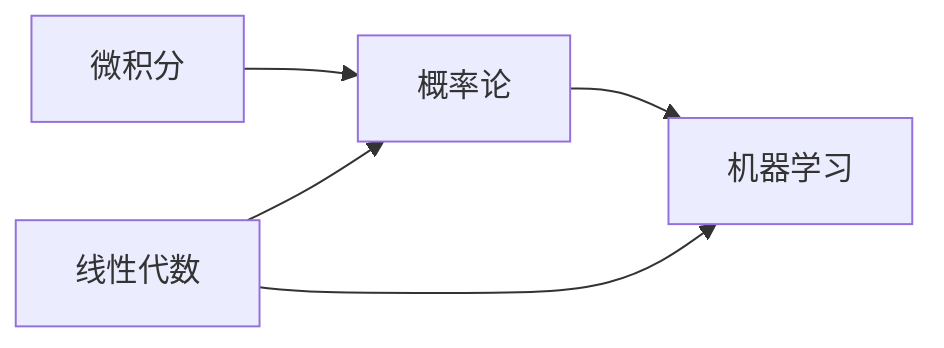
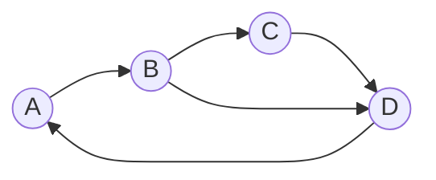
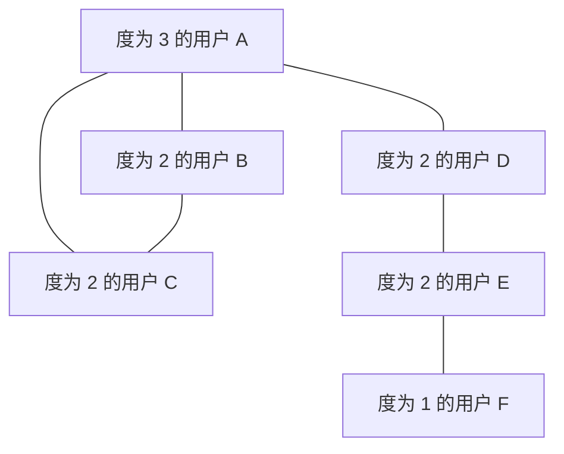
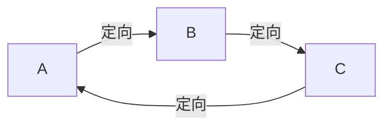
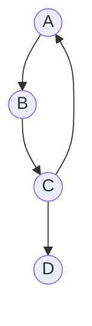
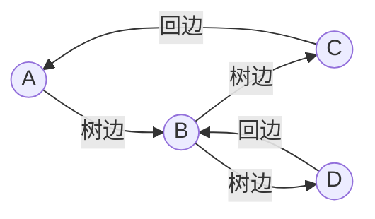

# SPL Run: build_concept_book

- **Adapter:** claude_cli
- **Model:** claude-sonnet-5
- **Tokens:** 12257 in / 2496 out
- **Latency:** 185753ms
- **Timestamp:** 2026-09-27 20:04:02

## Output

```output


---

## Directed Graph

**定义**

有向图（记作 $D = (V, A)$）由一个顶点集 $V$ 和一个弧集 $A$ 组成，其中每条弧是一个有序对 $\langle u, v \rangle$，表示从尾顶点 $u$ 指向头顶点 $v$ 的一条单向连接。与无向图不同，弧 $\langle u, v \rangle$ 和 $\langle v, u \rangle$ 是两条不同的弧——方向承载了实际信息，例如"任务 $u$ 必须在任务 $v$ 之前完成"或"网页 $u$ 链接到网页 $v$"。对每个顶点 $v$，我们区分**入度**（指向 $v$ 的弧数，记作 $\deg^-(v)$）和**出度**（从 $v$ 发出的弧数，记作 $\deg^+(v)$）。全图弧的总数满足：

$$|A| = \sum_{v \in V} \deg^+(v) = \sum_{v \in V} \deg^-(v)$$

这个恒等式的直观理由是：每条弧恰好为某个顶点贡献一个出度，也恰好为另一个顶点贡献一个入度，因此两侧求和方式不同但计的是同一批弧。

**实例求解**

考虑一个课程先修关系图：顶点为课程 {微积分, 线性代数, 概率论, 机器学习}，弧集为 $\{\langle 微积分, 概率论 \rangle, \langle 线性代数, 概率论 \rangle, \langle 概率论, 机器学习 \rangle, \langle 线性代数, 机器学习 \rangle\}$。要判断"机器学习"能否被安排在学期末学习，先检查是否存在从它出发又能绕回自身的弧序列（即环）。逐一追踪：从机器学习出发没有任何出弧，所以它必然是终点之一，不可能出现在环中。计算每个顶点的入度和出度：概率论的入度为 2、出度为 1；机器学习的入度为 2、出度为 0。出度为 0 的顶点称为"汇点"，在课程排序问题中，它天然适合排在最后。

**问题解决应用**

有向图的核心应用在于**依赖排序**：给定一组带有先修约束的任务，能否找到一个满足所有弧方向的线性顺序（拓扑排序）？解决思路是：反复选取当前入度为 0 的顶点（即无待完成前提的任务），将其输出并从图中移除，同时更新其后继顶点的入度，直到所有顶点被处理。若在某一步找不到入度为 0 的顶点，但图中仍有顶点未处理，说明存在环——这类任务集合无法被线性排序（例如"课程 A 需要课程 B，课程 B 又需要课程 A"）。这一算法正是编译器处理模块导入顺序、项目管理软件计算关键路径的基础。


*该图展示了课程先修关系的有向图结构：箭头方向表示先修约束，机器学习的入度为2、出度为0，是图中的汇点。*

---

## In Out Neighbor Sets

**定义**

设 $D = (V, A)$ 为一个有向图（digraph），其中 $V$ 是顶点集，$A$ 是弧（有向边）集。对于顶点 $v \in V$，定义其**入邻居集**（in-neighbor set）为所有指向 $v$ 的顶点构成的集合：

$$
N^-(v) = \{u \in V : (u, v) \in A\}
$$

定义其**出邻居集**（out-neighbor set）为 $v$ 所指向的所有顶点构成的集合：

$$
N^+(v) = \{w \in V : (v, w) \in A\}
$$

这两个集合的大小分别称为 $v$ 的**入度**与**出度**，记作 $\deg^-(v) = |N^-(v)|$ 和 $\deg^+(v) = |N^+(v)|$。需要注意，在有向图中 $N^-(v)$ 和 $N^+(v)$ 一般不相等，这与无向图中"邻居集"只有一种定义形成鲜明对比——方向性正是有向图建模能力的核心。

**举例说明**

考虑一个简单的网页链接图：顶点 $A, B, C, D$ 代表四个网页，弧 $(A,B)$ 表示"网页 A 中有一个链接指向网页 B"。若弧集为 $A = \{(A,B), (A,C), (B,C), (D,C)\}$，那么：

- $N^+(A) = \{B, C\}$（A 链接到 B 和 C），$N^-(A) = \varnothing$（没有网页链接到 A）；
- $N^-(C) = \{A, B, D\}$，$N^+(C) = \varnothing$。

顶点 $C$ 的入度为 3，说明它被大量引用，这正是网页排名（PageRank）等算法用来衡量"重要性"的基础信号。

**解题应用**

在算法实现中，入邻居集和出邻居集通常用邻接表存储：对每个顶点维护一个出邻居列表用于正向遍历（如广度优先搜索、拓扑排序），同时维护一个反向邻接表（入邻居列表）以支持逆向查询，例如"哪些顶点可以到达当前顶点"或计算入度用于 Kahn 算法的拓扑排序。构建反向邻接表的时间复杂度为 $O(|V| + |A|)$，与正向邻接表相同，因此在需要频繁做双向查询的场景（如网络流、依赖关系分析）中，同时维护两者是标准做法，而不会带来额外的渐近开销。

---

## Directed Walks Paths Cycles

在有向图 $D = (V, A)$ 中，**有向途径**（directed walk）是顶点与弧的交替序列 $v_0, a_1, v_1, a_2, v_2, \ldots, a_k, v_k$，其中每条弧 $a_i$ 都从 $v_{i-1}$ 指向 $v_i$——方向必须与箭头一致，不能逆向通过弧。这一约束是有向途径与无向图中途径的本质区别：在无向图里一条边可以双向使用，而在有向图中弧的方向是硬性规则。

若途径中所有弧互不相同，称为**有向迹**（directed trail）；若途径中所有顶点互不相同（自然弧也互不相同），称为**有向路径**（directed path）。若一条有向途径的起点与终点相同，且除首尾外其余顶点互不相同，长度至少为 1，则称为**有向圈**（directed cycle）。

**举例**：设有向图的弧集为 $A = \{(A,B), (B,C), (C,D), (D,A), (B,D)\}$。序列 $A \to B \to C \to D$ 是一条有向路径，因为每一步都顺着箭头方向前进，且顶点不重复。序列 $A \to B \to D \to A$ 则是一条有向圈，因为它从 $A$ 出发，最终又回到 $A$，中间顶点 $B, D$ 各出现一次。但序列 $B \to A$ 不存在，因为弧 $(A,B)$ 只允许从 $A$ 到 $B$ 通行，反向没有对应的弧。

**问题求解应用**：判断一个有向图中是否存在有向圈，是许多实际问题的核心步骤——例如任务调度中检测循环依赖、编译器检测程序中的死循环、微服务架构中检测调用链死锁。标准方法是对图做深度优先搜索（DFS），并维护三种顶点状态：未访问、正在处理（在当前递归栈中）、已完成。若搜索过程中遇到一条指向"正在处理"状态顶点的弧，就说明存在有向圈——这条弧连回了递归栈中的祖先顶点。该算法的时间复杂度为 $O(|V| + |A|)$，因为每个顶点和每条弧只被访问一次。这也是判断一个有向图是否可以进行拓扑排序的依据：一个有向图存在拓扑排序，当且仅当它不含有向圈（即为有向无圈图，DAG）。


*示意图：顶点 A、B、C、D 之间的有向弧；路径 A→B→C→D 沿箭头方向前进，而 A→B→D→A 构成一条有向圈。*

---

## Indegree Outdegree

在有向图中，每条弧（边）都有明确的方向——从一个顶点指向另一个顶点。这就产生了两个描述顶点连接情况的基本量：入度和出度。一个顶点的**入度**是指以该顶点为终点（头）的弧的数目；**出度**是指以该顶点为起点（尾）的弧的数目。如果把弧 $(u, v)$ 理解为"从 $u$ 指向 $v$"，那么这条弧对 $v$ 的入度贡献 $1$，对 $u$ 的出度贡献 $1$。

对于一个有 $n$ 个顶点、$m$ 条弧的有向图，所有顶点的入度之和与出度之和分别都等于弧的总数：

$$
\sum_{v \in V} \text{indeg}(v) = \sum_{v \in V} \text{outdeg}(v) = m
$$

这个关系之所以成立，是因为每一条弧恰好为某个顶点贡献一次入度、为另一个顶点贡献一次出度，二者是对同一组弧从两个不同角度的计数，因此总和必然相等。

**举例说明**：考虑一个描述任务依赖关系的有向图，顶点表示任务，弧 $A \to B$ 表示"任务 $A$ 必须先于任务 $B$ 完成"。若顶点 $B$ 有弧 $A \to B$ 和 $C \to B$ 指向它，则 $B$ 的入度为 $2$，意味着有两个前置任务；若 $B$ 又有弧 $B \to D$ 指出，则 $B$ 的出度为 $1$。入度为零的顶点（如 $A$、$C$）没有前置依赖，是可以立即开始的任务；出度为零的顶点是没有后续任务的终点。

**问题求解中的应用**：入度和出度是判断图结构性质的关键工具。在任务调度问题中，入度为零的顶点集合正是拓扑排序算法的起始点；在网络流问题中，源点的入度通常为零、出度大于零，汇点则相反；在网页排名（如 PageRank 的雏形思想）中，一个网页被链接的次数（入度）反映了它的重要性。计算入度和出度的方法很直接：遍历弧的列表，每遇到一条弧 $(u, v)$，就将 $u$ 的出度计数加一、$v$ 的入度计数加一，整个过程的时间复杂度为 $O(m)$，是分析有向图结构最基础也最高效的第一步。

---

## Underlying Graph（底图）

**定义**：给定有向图 $D = (V, A)$，其中 $V$ 是顶点集、$A$ 是弧（有向边）集，$D$ 的底图（underlying graph）$G(D) = (V, E)$ 是这样构造的无向图：对每条弧 $(u, v) \in A$，在 $E$ 中放入对应的无向边 $\{u, v\}$，即

$$
E = \{\, \{u, v\} \mid (u, v) \in A \,\}.
$$

直观地说，底图就是"去掉所有箭头方向"后得到的图：$D$ 中若存在弧 $u \to v$ 或 $v \to u$（甚至两者都有），底图中都只保留一条无向边 $\{u, v\}$——方向信息被丢弃，重复的一对顶点只算一条边。底图与原有向图拥有完全相同的顶点集，但边的数量可能因为双向弧合并而少于弧的数量。

**举例**：设 $D$ 的顶点集为 $\{A, B, C\}$，弧集为 $\{(A,B),\ (B,A),\ (B,C)\}$。注意 $A$ 与 $B$ 之间存在双向弧。取底图后，$(A,B)$ 与 $(B,A)$ 合并成同一条无向边 $\{A,B\}$，$(B,C)$ 变为 $\{B,C\}$。于是 $G(D)$ 的边集为 $E = \{\{A,B\}, \{B,C\}\}$，是一个只有两条边的简单无向图。

**问题求解中的应用**：底图最常被用来判断有向图的"弱连通性"。一个有向图 $D$ 被称为弱连通，当且仅当它的底图 $G(D)$ 是连通的——也就是说，如果不考虑方向、仅把每条弧看作双向可通行的道路，任意两个顶点之间都存在路径。这与"强连通"（要求严格按箭头方向也能相互到达）是两个不同的概念，二者之间只有强连通蕴含弱连通，反之不成立。在实践中，判断弱连通性的算法非常直接：先构造底图（把每条弧替换为无向边、去重),再对这个无向图跑一次标准的深度优先搜索或并查集（union-find），检查是否只有一个连通分量。这种"先转化再套用无向图算法"的思路，是处理有向图连通性问题的标准技巧。

---

## Degree Distribution

**定义**

在一个图（或有向图）中，度分布描述的是"具有某个特定度值的顶点，在图中占多少个（或占多大比例）"。设图中共有 $n$ 个顶点，令 $N_k$ 表示度数恰好为 $k$ 的顶点个数,则度分布可以表示为一个概率质量函数:

$$
P(k) = \frac{N_k}{n}
$$

其中 $P(k)$ 表示随机抽取一个顶点,其度数恰好为 $k$ 的概率。对于有向图,通常需要分别统计入度分布与出度分布,因为二者刻画的意义不同——入度反映"被指向的程度"（如网页被链接的次数),出度反映"主动指向他人的程度"（如账号关注他人的数量)。

**范例**

考虑一个社交网络,包含 6 个用户,其好友关系（无向边)如下:A-B, A-C, A-D, B-C, D-E, E-F。计算各顶点的度: A 的度为 3(连接 B、C、D),B 的度为 2,C 的度为 2,D 的度为 2,E 的度为 2,F 的度为 1。度值集合为 $\{1, 2, 3\}$,对应的顶点数为 $N_1=1, N_2=4, N_3=1$,总顶点数 $n=6$。于是度分布为:

$$
P(1)=\frac{1}{6},\quad P(2)=\frac{4}{6}=\frac{2}{3},\quad P(3)=\frac{1}{6}
$$

这说明该网络中大多数用户拥有中等数量（2 个)的好友,只有极少数是"边缘用户"（度为 1)或"局部枢纽"（度为 3)。

**问题求解应用**

度分布是判断图的宏观结构类型的关键工具。如果度分布近似服从泊松分布,则该图接近"随机图"（如 Erdős–Rényi 模型),各顶点的连接数相对均匀,没有明显的"超级节点"。但如果度分布呈现幂律形式,即:

$$
P(k) \sim k^{-\gamma}
$$

（其中 $\gamma$ 通常在 2 到 3 之间),则该图具有"无标度网络"的特征——绝大多数顶点度数很低,但存在极少数度数极高的"枢纽节点"(hub)。这类结构常见于互联网拓扑、引文网络和蛋白质相互作用网络。在实际问题中，工程师可以通过绘制度分布的对数-对数坐标图(log-log plot),观察是否呈现近似直线,来快速判断网络是否具有无标度特性,从而决定采取何种容错设计——例如,无标度网络对随机故障具有较强鲁棒性,但对针对枢纽节点的定向攻击却异常脆弱。


*该示例网络的结构图,展示了度为 1、2、3 的顶点分布情况,对应正文中计算的度分布。*

---

## 定向

给定一个无向图 $G=(V,E)$，为每一条边 $\{u,v\}\in E$ 选定唯一的方向——要么记作有向边 $(u,v)$，要么记作 $(v,u)$——所得到的有向图 $D(G)$ 称为 $G$ 的一个**定向**（orientation）。定向的关键要求是：每条无向边恰好变成一条有向边，既不能保留原来的双向连接，也不能丢弃这条边。同一个无向图往往存在指数多个不同的定向，每一个定向都是原图连通结构的一种"单向化"版本。

**举例**：考虑三角形 $K_3$，顶点为 $\{A,B,C\}$，边为 $\{A,B\},\{B,C\},\{C,A\}$。至少有两类本质不同的定向：其一是"循环式"定向 $A\to B\to C\to A$，这样得到的有向图是强连通的——从任一顶点出发都能沿有向边回到自身；其二是"传递式"定向 $A\to B,\ B\to C,\ A\to C$，此时不存在从 $C$ 回到 $A$ 的有向路径，图不再强连通，反而形成一个全序结构（这正是竞赛图/tournament 中"传递竞赛图"的雏形）。

**问题求解中的应用**：一个自然的问题是——给定的无向图 $G$，是否存在一个强连通的定向？这不是任意猜测能回答的问题，而由罗宾斯定理（Robbins' theorem, 1939）精确刻画：图 $G$ 存在强连通定向，当且仅当 $G$ 是连通且无桥的（即 2-边连通）。这一判据把"能否定向为强连通"这一有向图问题，转化为纯无向图上桥的检测问题——而桥可以用深度优先搜索在线性时间内找到。因此在实际问题中（例如判断一个道路网络能否改造为单行道系统且仍保持任意两地互达），只需先跑一次桥检测算法，再据此决定是否需要新增道路，而无需逐一尝试所有定向方案。


*三角形 $K_3$ 的一个循环式定向，使 $D(G)$ 强连通。*

---

## Strong Weak Connectivity

**定义**

有向图（digraph）$G = (V, E)$ 中的连通性有两个层次。若对图中任意一对顶点 $u, v$，都存在一条从 $u$ 到 $v$ 的有向路径,**且**存在一条从 $v$ 到 $u$ 的有向路径,则称 $G$ 是**强连通**的。若只要求将每条有向边替换为无向边后得到的**基础图**（underlying graph）是连通的,则称 $G$ 是**弱连通**的。强连通蕴含弱连通,但反之不成立——弱连通只保证"能够到达",不保证"方向上能互达"。

**判定方法**

判断强连通性最直接的方法是：从任意顶点 $v$ 出发做一次深度优先搜索（DFS），若能到达所有其他顶点,再对边方向取反后的图 $G^T$（转置图）从 $v$ 出发再做一次 DFS,若同样能到达所有顶点,则 $G$ 强连通。这个判定基于一个事实：只要存在一个顶点 $v$ 能与所有其他顶点互达,则任意两点之间也必然互达（通过 $v$ 中转）。这两次 DFS 的总时间复杂度为 $O(|V| + |E|)$,与图的规模成线性关系。

**应用举例**

考虑一个由四个网页 $A, B, C, D$ 组成的超链接网络：$A \to B$、$B \to C$、$C \to A$、$C \to D$。检验发现 $A, B, C$ 三者之间互相可达,构成一个强连通分量;但没有任何边从 $D$ 指回 $A, B, C$,所以 $D$ 只能被到达,不能反向到达其他节点。整个图仍是弱连通的（去掉方向后所有点相连）,但不是强连通的。这类分析正是 Google 早期 PageRank 算法关注"强连通分量"的原因——只有在强连通的网页子集中,链接权重才能形成稳定的循环传递。识别一个大型有向图中的所有强连通分量,是 Kosaraju 算法或 Tarjan 算法要解决的核心问题,广泛用于编译器的依赖分析、社交网络的社区发现等场景。


*该图中 A、B、C 构成一个强连通分量（可互相到达）,而 D 只能被单向到达；整体仍是弱连通的，因为去除方向后所有节点相连。*

---

## Strongly Connected Orientation

**定义**：给定一个无向连通图 $G$，为它的每条边指定一个方向，得到一个有向图。如果这个定向后的有向图是强连通的——即对任意两点 $u, v$，既存在从 $u$ 到 $v$ 的有向路径，也存在从 $v$ 到 $u$ 的有向路径——就称这是 $G$ 的一个强连通定向。

这个概念背后有一个精确的判定条件，由 Robbins 定理（单行道定理）给出：

$$
G \text{ 存在强连通定向} \iff \lambda(G) \geq 2
$$

其中 $\lambda(G)$ 表示 $G$ 的边连通度，即为了让图不连通所需删除的最少边数。直观上，$\lambda(G) \geq 2$ 意味着图中不存在桥（割边）。这个条件既是必要的也是充分的：如果 $G$ 含有一条桥 $e = (u,v)$，那么无论怎样给 $e$ 定向，都只能单向地在 $u$ 和 $v$ 之间通行，破坏了强连通性，所以桥的存在使强连通定向不可能；反过来，Robbins 证明了只要图是 2-边连通的（没有桥），就总能通过对每条边沿着某个深度优先搜索树的遍历顺序定向——树边一律指向遍历深入的方向，非树边（回边）一律指向遍历回溯的方向——从而得到一个强连通的有向图。

**实例求解**：考虑一个由两个三角形通过一条公共边连接而成的图（形似"蝴蝶结"但中间的边不是桥，而是两个环各自独立经过）。若该边是桥（即两个三角形仅由一条边相连、且删除后图断成两块），则边连通度为 1，无法强连通定向。但若额外加一条边使两个三角形之间形成两条不相交的连接路径，边连通度提升为 2，此时对图做一次深度优先遍历：树边指向遍历方向，回边指向祖先方向，即可验证任意两点间都存在双向路径。

**应用**：这一原理广泛用于单行道网络设计——城市规划者要将双向道路改为单行道系统时，必须先检验道路网络是否 2-边连通（无关键孤立路段），否则某些区域会变得不可达。



*深度优先遍历定向示例：树边沿遍历方向、回边沿回溯方向，构成强连通的有向图。*

---

## Payoff

一个连通的无向图 $G$ 何时可以把每条边都指定一个方向，使得结果变成一个"任意两点互相可达"的有向图？这正是强连通定向要回答的问题，而答案出人意料地简洁：当且仅当 $G$ 是 2-边连通的，也就是说它的边连通度满足 $\lambda(G) \geq 2$。这个结论是罗宾斯定理（Robbins' theorem），它把一个看似需要逐一尝试所有定向方案的组合难题，压缩成一个只需检验图的边连通性的判定条件。

这个结果之所以是本书的自然终点，是因为它把前面几个概念严丝合缝地拼合在一起。度分布告诉我们每个顶点有多少条边可供分配方向；定向本身是把无向边替换成有向边这一操作的形式化；而强弱连通性则给出了判断"任意两点互相可达"的标准——强连通定向正是要求整张图在定向之后达到强连通。罗宾斯定理的证明思路依赖于图的边连通结构：如果 $G$ 中存在一座桥（一条删除后会断开图的边），那么无论怎样定向这条桥，都无法让两个方向的可达性同时成立，因为桥的两侧必然只能单向通行。反过来，如果 $G$ 没有桥（即 $\lambda(G) \geq 2$），可以通过深度优先搜索构造出耳分解（ear decomposition），逐步添加"耳朵"路径并保持强连通性，从而构造出一个具体的强连通定向。

这个概念的现实回响随处可见：城市单行道系统的设计要求任意两个路口都能相互到达，规划者需要先确认路网是否 2-边连通，再决定具体的单行方向；通信网络中把双向链路改造成单向以节省带宽时，同样需要保证网络仍然全连通。

理解了罗宾斯定理，你已经掌握了一套完整的思维工具：从统计一个图的局部特征（度分布），到操作它的边（定向），再到判定它的全局性质（强弱连通性），最后用一个优雅的充要条件把它们统一起来。不妨拿一张你熟悉的地图或网络图，先计算它的边连通度，再动手尝试构造一个强连通定向——这是检验你是否真正吃透这一整套连通性理论的最好方式。
```
